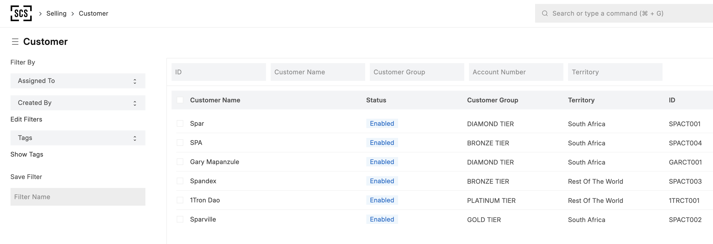

# Entropy

## Overview

Entropy is a custom ERPNext application developed by Commquest Technologies (Pty) Ltd. that enhances the standard ERPNext functionality with specialized features for business process management. The application focuses on providing robust, standardized naming conventions and duplicate prevention for critical business entities.



## Key Features

### 1. Custom Naming System

Entropy implements a sophisticated naming convention for Customer and Supplier DocTypes in ERPNext:

- **Standardized Format**: All Customer and Supplier IDs follow a consistent, predictable format: `[NAME_PREFIX][COMPANY_ABBR][SEQ_NUM]`
- **Concurrency Safety**: Generates unique IDs reliably even when multiple users save documents simultaneously
- **Duplicate Prevention**: Prevents the creation of Customers or Suppliers with identical names (case-insensitive)

#### Naming Format Details

- **NAME_PREFIX**: First 1-3 uppercase alphanumeric characters of the Customer/Supplier Name
- **COMPANY_ABBR**: The abbreviation configured for the relevant company
- **SEQ_NUM**: A zero-padded sequential number unique per combination of prefix and company

Example:

- A Customer named "Spar Retail" linked to a Company with abbreviation "ABC" might get the ID: `SPAABC001`
- The next Customer named "Spar Wholesale" for the same company would get: `SPAABC002`
- A Supplier named "Global Supplies" for a company with abbreviation "XYZ" might get: `GLOXYZ001`

### 2. Migration Tools

Entropy includes tools for migrating existing Customer and Supplier records to the new naming format:

- Batch processing for safe, scalable migration
- Comprehensive link updating across the entire database
- Dry-run mode for testing before making changes
- Detailed logging for tracking migration progress

## Installation

### Prerequisites

- ERPNext v14 or higher
- Python 3.10+
- Frappe Bench

### Steps

1. Navigate to your bench folder:

   ```bash
   cd /path/to/your/bench
   ```

2. Get the Entropy app from GitHub:

   ```bash
   bench get-app https://github.com/Commquest-Technologies/entropy
   ```

3. Install the app on your site:

   ```bash
   bench --site your-site install-app entropy
   ```

4. Run migrations to apply any pending changes:

   ```bash
   bench --site your-site migrate
   ```

## Configuration

After installation, the custom naming system will be automatically applied to new Customer and Supplier records. To migrate existing records, follow the instructions in the [Migration Guide](entropy/docs/migrate_existing_ids.md).

### Constants Configuration

You can modify the following constants in `entropy/utils/custom_naming.py` to adjust the naming behavior:

- `DEFAULT_COMPANY_ABBR`: Fallback company abbreviation (default: "CO")
- `DEFAULT_NAME_PREFIX`: Fallback name prefix (default: "UNK")
- `DEFAULT_PADDING`: Number of digits for the sequence number (default: 3)
- `MAX_PREFIX_LENGTH`: Maximum length of the name prefix (default: 3)

## Documentation

Detailed documentation is available in the `entropy/docs` directory:

- [Custom Naming System](entropy/docs/custom_naming.md)
- [Migration Guide](entropy/docs/migrate_existing_ids.md)

## Development

### Setup Development Environment

1. Clone the repository:

   ```bash
   git clone https://github.com/Commquest-Technologies/entropy
   ```

2. Set up a development bench:

   ```bash
   bench init dev-bench
   cd dev-bench
   bench get-app erpnext
   bench get-app --local /path/to/entropy
   bench new-site dev-site
   bench --site dev-site install-app erpnext
   bench --site dev-site install-app entropy
   ```

### Contributing

1. Fork the repository
2. Create a feature branch
3. Make your changes
4. Submit a pull request

## Support

For support, please contact:

- Email: [info@commquest.co.za](mailto:info@commquest.co.za)
- Website: [Commquest Technologies](https://commquest.co.za)

## License

MIT License

Copyright (c) 2025 Commquest Technologies (Pty) Ltd.

Permission is hereby granted, free of charge, to any person obtaining a copy
of this software and associated documentation files (the "Software"), to deal
in the Software without restriction, including without limitation the rights
to use, copy, modify, merge, publish, distribute, sublicense, and/or sell
copies of the Software, and to permit persons to whom the Software is
furnished to do so, subject to the following conditions:

The above copyright notice and this permission notice shall be included in all
copies or substantial portions of the Software.

THE SOFTWARE IS PROVIDED "AS IS", WITHOUT WARRANTY OF ANY KIND, EXPRESS OR
IMPLIED, INCLUDING BUT NOT LIMITED TO THE WARRANTIES OF MERCHANTABILITY,
FITNESS FOR A PARTICULAR PURPOSE AND NONINFRINGEMENT. IN NO EVENT SHALL THE
AUTHORS OR COPYRIGHT HOLDERS BE LIABLE FOR ANY CLAIM, DAMAGES OR OTHER
LIABILITY, WHETHER IN AN ACTION OF CONTRACT, TORT OR OTHERWISE, ARISING FROM,
OUT OF OR IN CONNECTION WITH THE SOFTWARE OR THE USE OR OTHER DEALINGS IN THE
SOFTWARE.
